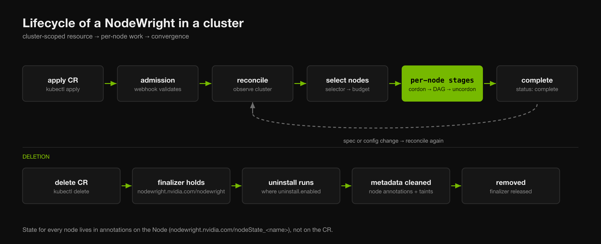
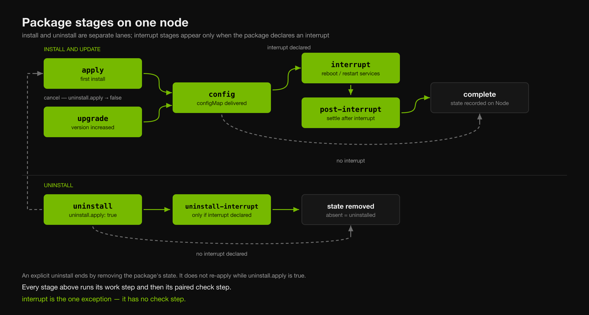
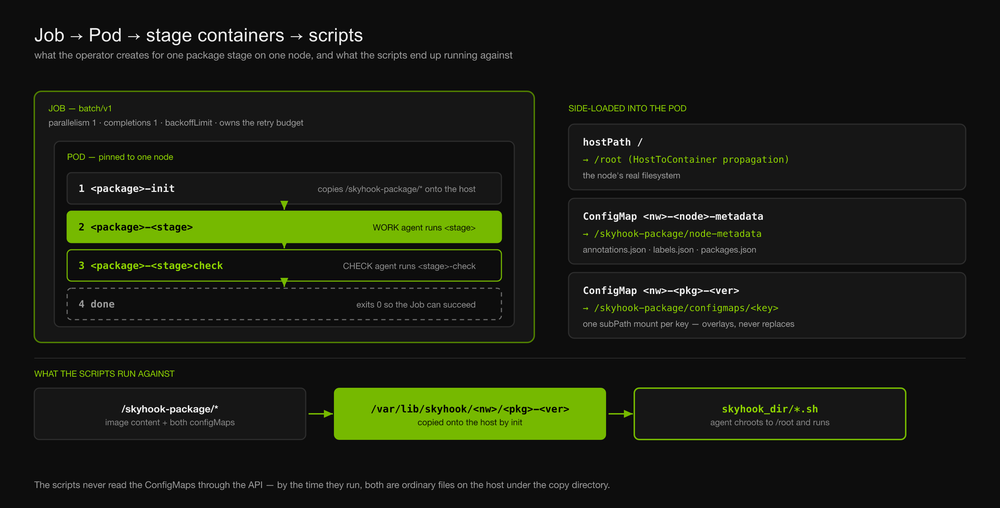
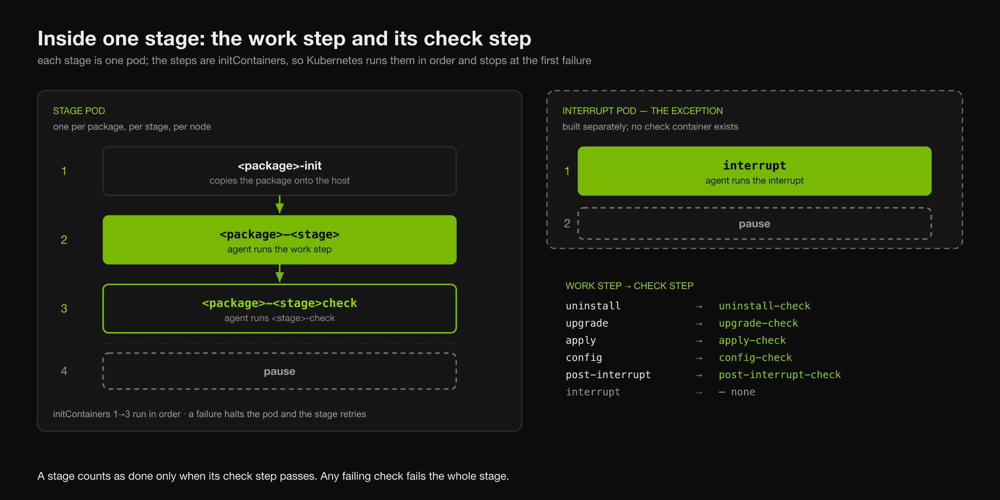

# Lifecycle of a NodeWright

This page follows a `NodeWright` from `kubectl apply` to `complete`, and then
through change and deletion. It is the "what happens, in what order" companion to
[The NodeWright Custom Resource](../user-guide/custom-resource.md), which
describes the fields themselves.

The through-line is the pairing that shows up at every level: **every unit of
work has a check that decides whether it actually worked.** A stage is not done
because its script exited zero — it is done because its check said so.

---

## Three lifecycles, not one

"Lifecycle" means three different things depending on what you are looking at,
and they nest:

| Scope | Question it answers | Where it is recorded |
|---|---|---|
| **The resource** | Is this NodeWright rolling out, paused, blocked, complete? | `status.status` on the CR |
| **A node** | Has this node finished everything this NodeWright asks of it? | `status.nodeStatus[<node>]` |
| **A package on a node** | Which stage is this package in, and did it succeed? | Annotation on the **Node** |

The vocabulary for these — Status, State, Stage — is deliberately similar and
easy to conflate. If you have not read
[Operator Status Definitions](operator-status.md), read it before this page; the
rest of this document uses those three words precisely.

---

## The cluster-level arc



### 1. Admission

The validating webhook runs before the object is ever stored. It rejects
malformed specs outright — an invalid semver, a tag embedded in `image`, a
`configInterrupts` key matching nothing, a `dependsOn` cycle, a
`deploymentPolicy` that does not exist. The full list is in the
[validation rules](../user-guide/custom-resource.md#validation-rules).

This is the only synchronous feedback you get. Everything after admission is
asynchronous and surfaces through status and conditions.

### 2. Reconcile

The operator is **level-triggered**: each reconcile looks at the current state of
the cluster and works out what to do from scratch. It does not remember the
previous pass, and it does not assume any particular event triggered this one. A
reconcile is queued by changes to the CR, to matching Nodes, or to the package
pods the operator owns.

Each pass builds a snapshot of what packages exist on which nodes and what stage
each is in, then compares that against the spec.

### 3. Node selection

`nodeSelectors` picks the candidate nodes. The interruption budget — or the
compartments of a [DeploymentPolicy](../user-guide/deployment-policy.md) — decides
how many of those may be worked on at once. Nodes carrying the
`nodewright.nvidia.com/ignore` label are selected into the batch and then
skipped as `blocked`, which means **they still consume a slot**.

### 4. Per-node gating

Before any package runs on a node, the node must clear:

- **Priority and sequencing** — higher-priority NodeWrights must have finished
  first, per node or cluster-wide depending on `sequencing`. See
  [Strict Ordering](ordering.md).
- **Taint toleration** — package pods must tolerate every taint on the node, or
  the node is marked `blocked` with a `TaintNotTolerable` condition.
- **Cordon and drain** — only for packages that declare an `interrupt`. See
  [Interrupt Flow](interrupt-flow.md).

### 5. Completion

When every package reaches its terminal stage on a node, the node is uncordoned
and, if `runtimeRequired` is set, the runtime-required taint is removed. When
every selected node is done, the resource reports `complete`.

---

## Package stages on a node

Within a node, packages run in dependency order — `dependsOn` forms a DAG, and
packages with no unmet dependencies run in parallel unless `serial: true`.

Each package then walks its own stage machine. Which stage it *enters* depends on
what changed:



```text
  install lane
    first install     apply ──▶ config ──▶ [ interrupt ──▶ post-interrupt ] ──▶ complete
    version bump    upgrade ──▶ config ──▶ [ interrupt ──▶ post-interrupt ] ──▶ complete

  uninstall lane
    uninstall.apply   uninstall ──▶ [ uninstall-interrupt ] ──▶ state removed

  [ ] = only when the package declares an interrupt
```

Install and uninstall are separate lanes, not one loop. Two things about the
uninstall lane are worth knowing:

- **An explicit uninstall ends by deleting the package's state, not by
  re-applying it.** When the uninstall finishes, the package's entry is removed
  from the node's state annotation — `absent` *is* how the operator records
  "uninstalled". While `uninstall.apply` stays `true`, every later reconcile sees
  the package as already gone and skips it, so it does not come back.
- **A package with an interrupt routes through a distinct `uninstall-interrupt`
  stage** rather than reusing the install-side interrupt stage. Once it reaches
  that stage the uninstall is no longer cancellable — the interrupt has fired and
  must run to completion.

A package does return in two cases, and neither is the steady state above:

- **Cancel.** Setting `uninstall.apply` back to `false` re-enters the install
  pipeline — from `apply` if the uninstall already completed, or by resetting the
  in-flight uninstall if it has not yet reached `uninstall-interrupt`.
- **Downgrade.** The old version is uninstalled and the new version applies. Node
  state is keyed by `name|version`, so as far as the operator is concerned those
  are two different packages: a removal followed by a fresh install, not a
  package coming back.

Removing a package from the spec is a third thing again, and it is not an
uninstall — see [Uninstall](../user-guide/uninstall.md) for how the two differ
and why the webhook blocks the unsafe ordering.

A package only advances when its current stage has completed — which raises the
question of what a stage actually *is*, and what decides that it finished.

---

## What runs a stage: Job, Pod, containers, scripts

One **Job** per package, per stage, per node — not a bare pod. Four layers nest,
and each owns something distinct:



| Layer | What it owns |
|---|---|
| **Job** (`batch/v1`) | The retry budget. `parallelism: 1`, `completions: 1`, and a `backoffLimit` that decides when a stage gives up. |
| **Pod** | Placement. Pinned to one node by name, and the thing that actually mounts the host. |
| **Containers** | Ordering. `initContainers` run in sequence: copy, then work, then check. |
| **Scripts** | The real work, executed on the host through a chroot. |

Several Job-level settings exist to stop Kubernetes from doing something
reasonable-but-wrong to a node-pinned host agent:

- **`podReplacementPolicy: Failed`** — a replacement pod is only created once the
  previous one has fully terminated, so two executors never overlap on the shared
  hostPath mounts.
- **A `podFailurePolicy` that ignores `DisruptionTarget`** — an eviction or
  preemption is not the package's fault, so it does not burn a retry.
- **Unbounded `not-ready` / `unreachable` tolerations** — without them the taint
  manager evicts the pod when a reboot-class interrupt takes the node `NotReady`
  past the default 300s, replacing a pod for a node that is coming back.
- **`ttlSecondsAfterFinished` set at completion, by outcome** — failed Jobs are
  kept longer than successful ones, so failure logs are still there when you go
  looking.

Interrupt Jobs invert two of these: `restartPolicy: OnFailure` and an effectively
unbounded `backoffLimit`, because under `OnFailure` the limit counts container
restarts — and the in-place restart *is* the reboot recovery.

---

## Inside a stage: the work step and its check step

This is the mechanism that makes the rest of the lifecycle trustworthy.

### The work and check containers



Within the stage pod, the steps are `initContainers`, which matters: Kubernetes runs
init containers strictly in order and stops the pod at the first one that fails.

```text
┌─ stage pod ─────────────────────────────────────────────────────────┐
│                                                                     │
│  initContainers        run in order · halt on the first failure     │
│                                                                     │
│    1  <package>-init             copies the package onto the host   │
│           │                                                         │
│           ▼                                                         │
│    2  <package>-<stage>          WORK    agent runs <stage>         │
│           │                                                         │
│           ▼                                                         │
│    3  <package>-<stage>check     CHECK   agent runs <stage>-check   │
│                                                                     │
│  containers                                                         │
│    4  pause                      holds the pod open                 │
│                                                                     │
└─────────────────────────────────────────────────────────────────────┘
```

Because the check is the container *after* the work container, two properties
fall out for free:

- **The check never runs if the work step failed.** Kubernetes will not start
  init container 3 if init container 2 exited non-zero.
- **The stage is not complete until the check passes.** The pod has not finished
  its init sequence until step 3 succeeds, so the operator never sees the stage
  as done.

The pod's restart policy is `OnFailure`, so a failing work or check step retries
rather than wedging. It surfaces as `erroring` once the operator's retry budget
is spent.

### The pairing

The check mode is derived from the stage name by appending `-check`:

```text
uninstall        →  uninstall-check
upgrade          →  upgrade-check
apply            →  apply-check
config           →  config-check
post-interrupt   →  post-interrupt-check

interrupt        →  (none)
```

> **Note the two spellings.** The agent *mode* is `<stage>-check`
> (`apply-check`), but the *container name* is `<package>-<stage>check` with no
> hyphen (`tuning-applycheck`). When you are reading `kubectl get pod -o yaml` or
> hunting through logs, the container you want is the one ending in `check`.

### `interrupt` is the exception

`interrupt` is the one work step with no check step. This is not an oversight and
it is not a gap you can fill from a package:

- The agent lists `interrupt` in `NON_STEP_MODES` and has no `INTERRUPT_CHECK`
  mode to dispatch to.
- The operator builds interrupt pods from a **different template** — a single
  init container running the interrupt, with no check container to add.

The reason is that an interrupt is not a script whose success you can inspect
afterward from the same process. A `reboot` interrupt ends the node; nothing
survives to run a check. What plays the verifying role instead is
**`post-interrupt`**, which runs after the node comes back and *does* have a
`post-interrupt-check`. If you need to assert that an interrupt achieved
something, assert it there.

### What "the check passed" actually means

The check step is not a single exit code. A package may define several check
steps for a stage, and the agent evaluates them together:

- **Any failing check fails the whole stage.** There is no partial credit.
- **Not having run every check counts as failure.** If the number of results does
  not match the number of check steps defined, the stage fails rather than
  passing by default.
- **Success is recorded on the host.** The agent writes a
  `<mode>_ALL_CHECKED` flag file so a re-run can skip work already proven done.

That last point is what makes stages cheap to re-run — which matters, because a
level-triggered operator re-runs things.

### Idempotence, and where it does not apply

Most stages are skipped when their flag file already exists. Three are not:
`config`, `uninstall`, and `upgrade` deliberately **ignore** the flag and run
again. Their inputs change in ways a flag cannot capture — a rewritten
`configMap` key, a version transition with a specific from/to — so re-running is
the correct behavior, and a package's scripts for those stages must tolerate
being invoked more than once.

---

## Side-loading: what a script can actually see

A package's scripts never talk to the Kubernetes API. Everything they need is put
in front of them as files, in two moves.

### 1. Three volumes mount into the pod

| Mounted | At | Contents |
|---|---|---|
| `hostPath: /` | `/root` | The node's real filesystem, with `HostToContainer` mount propagation |
| ConfigMap `<nodewright>-<node>-metadata` | `/skyhook-package/node-metadata` | `annotations.json`, `labels.json`, `packages.json` |
| ConfigMap `<nodewright>-<package>-<version>` | `/skyhook-package/configmaps/<key>` | One `subPath` mount per key |

The **node-metadata ConfigMap is generated per node**, and it is how a script
learns anything about where it is running: the node's labels and annotations
serialized to JSON, plus the operator's own view of the package set. The operator
rewrites it when that metadata changes.

The **package ConfigMap is mounted one key at a time**, which is deliberate and
worth understanding before changing it:

> Mounting the whole ConfigMap as a directory would **replace** everything at
> `/skyhook-package/configmaps`, hiding any files the package image baked in
> there. Per-key `subPath` mounts **overlay** individual files on top of the image
> content instead. The trade-off is that `subPath` mounts do not receive live
> ConfigMap updates — harmless here, because a stage pod is recreated on every
> stage and every version bump anyway.

This is also why `configMap` keys cannot contain `/`: each key becomes one
mount path and one filename.

### 2. The init container copies it onto the host

```text
   /skyhook-package/*                    (in the container)
          │
          │  init container:  cp -r  →  /root/$SKYHOOK_DIR
          ▼
   /var/lib/skyhook/<nodewright>/<package>-<version>-<uid>-<generation>/
          ├─ skyhook_dir/...             the step scripts
          ├─ configmaps/...              your configMap keys, as plain files
          └─ node-metadata/...           annotations.json · labels.json · packages.json
```

The agent then chroots into `/root` — the host's real root — and runs the step
script out of that copy directory. So by the time a script executes:

- It runs **on the host**, not in the container. The container is a delivery
  mechanism, not the execution environment.
- Its configuration is an ordinary file on disk. A script reads
  `configmaps/<key>` the way it would read any config file, with no awareness
  that Kubernetes was involved.
- The copy directory is keyed by **UID and generation**, so an edited CR produces
  a fresh directory rather than a half-updated one, and two generations never
  share a path.

Two host-absolute paths are exported into every step's environment so a package
never has to hardcode the layout above: **`SKYHOOK_DIR`** (the copy directory
itself) and **`STEP_ROOT`** (its `skyhook_dir/` subdirectory, where the scripts
live). Both are reserved by the agent. The rest of the agent's environment is
documented in [`agent/README.md`](../../agent/README.md).

---

## Where the state lives

Per-package state is persisted as an annotation on the **Node**, not on the
NodeWright:

```text
nodewright.nvidia.com/nodeState_<nodewright-name>
  └─ { "<package>|<version>": { "stage": "config", "state": "complete", … } }
```

This is deliberate. The node is the thing being modified, so the record of what
was done to it travels with it. It also means the operator can rebuild its whole
picture from the cluster after a restart or a leader-election change — there is
no reconciler-held memory to lose.

The CR's `status` is a *published observation* of those annotations, re-derived
each pass. Editing status changes nothing; clearing a node's annotation genuinely
does reset that node's work.

---

## Change

A NodeWright is not finished when it reports `complete` — it is converged. Change
the spec and it converges again:

| What you change | What happens |
|---|---|
| Package `version` increases | Package re-enters at `upgrade` |
| Package `version` decreases | Rejected unless the package was explicitly uninstalled first |
| A `configMap` key | Package re-enters at `config`; `configInterrupts` decides whether that costs an interrupt |
| `nodeSelectors` | Newly matching nodes are enrolled; newly excluded nodes leave scope — their host changes remain |
| `image` or `containerSHA` only | No stage change — `version` is the ordering key |

The `pause` and `disable` annotations stop the rollout without touching the spec,
so toggling them does not bump `metadata.generation`.

---

## Deletion

Deleting a NodeWright does not delete the changes it made to your hosts. The
`nodewright.nvidia.com/nodewright` finalizer holds the object open while the
operator:

1. Runs the uninstall workflow for every package with `uninstall.enabled: true`
2. Cleans its metadata off the nodes — state annotations, cordons it owns, and
   the runtime-required taint
3. Releases the finalizer, at which point the object disappears

Packages without `uninstall.enabled` are simply forgotten, not reversed. Their
host changes stay. The failure modes here — including a deletion that deadlocks
on a package stuck at `erroring` — are catalogued in
[Uninstall](../user-guide/uninstall.md).

---

## See also

- [The NodeWright Custom Resource](../user-guide/custom-resource.md) — every field
- [Operator Status Definitions](operator-status.md) — Status / State / Stage
- [Interrupt Flow](interrupt-flow.md) — cordon, drain, interrupt
- [Strict Ordering](ordering.md) — priority and sequencing across NodeWrights
- [Uninstall](../user-guide/uninstall.md) — explicit uninstall and CR deletion
- [Deployment Policy](../user-guide/deployment-policy.md) — compartments and batching
