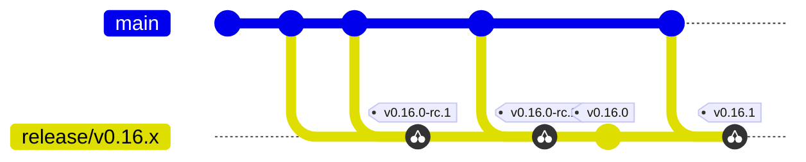

# NodeWright Release Process

Step-by-step process for releasing NodeWright components using **release branches**.

## Release Branch Strategy

At feature-freeze a release branch is cut from `main`. All release candidates and the final release for that minor version are tagged on that branch, and every later patch for the same minor line is cherry-picked back to the same branch and tagged from there. The release branch is the single source of truth for everything that ships under one minor version — once it exists, nothing for that minor goes anywhere else.

**Flow (one minor line):**



`X`, `Y`, `Z` are fixes that land on `main` first and get cherry-picked to `release/v0.16.x`. Each RC and the final release are tagged on that branch. Patches (`v0.16.1`, …) stay on the same release branch.

**Key principles:**

- **Branch first, then tag.** Always cut the release branch before the first RC. Tags only live on release branches, never on `main`.
- **Cherry-pick from `main`.** Any fix or feature destined for a release lands on `main` first, then is cherry-picked to the release branch. The release branch is never the place to *develop* — only to *stabilize and ship*.
  - Rare exception: a change that is genuinely release-branch-only (e.g. a `chart/Chart.yaml` version bump for that line) can be committed directly to the release branch via a feature branch and PR.
- **RCs are the validation gate.** Cut `-rc.1`, `-rc.2`, … on the release branch until you're happy. When an RC is approved, make a single `Chart.yaml` bump commit dropping the `-rc.N` suffix and tag `vX.Y.0` on that commit — no other code changes between the last good RC and the final release.
- **Patches stay on the same branch.** `v0.16.1`, `v0.16.2`, … are all cut from `release/v0.16.x` — cherry-pick the fix from `main`, bump `chart/Chart.yaml`, tag.
- **Component naming:** Operator drives the release; agent often reuses the previous version; chart always gets tagged because `Chart.yaml` (and therefore `appVersion`) moves with every release.

### Major/Minor Release Workflow

```bash
# 1. Cut the release branch from main at feature-freeze.
git checkout main && git pull origin main
git checkout -b release/v0.16.x
git push origin release/v0.16.x

# 2. Cherry-pick anything that has merged to main since the cut but belongs in the release.
#    Repeat throughout the stabilization period.
git cherry-pick -x <sha-on-main>
git push origin release/v0.16.x

# 3. Prepare the chart for the RC. Edit chart/Chart.yaml:
#    version: v0.16.0-rc.1
#    appVersion: v0.16.0-rc.1
git commit -am "release: prepare v0.16.0-rc.1"
git push origin release/v0.16.x

# 4. Tag the RC on the release branch.
git tag operator/v0.16.0-rc.1
git tag chart/v0.16.0-rc.1
# Tag agent only if it changed since the last released agent version.
git push origin operator/v0.16.0-rc.1 chart/v0.16.0-rc.1

# 5. Validate the RC. If issues are found, cherry-pick more fixes from main,
#    bump Chart.yaml to v0.16.0-rc.2, and tag -rc.2. Repeat until clean.

# 6. Cut the final release on the same commit as the last good RC.
#    Bump Chart.yaml to v0.16.0 (drop the -rc.N suffix) and commit.
git commit -am "release: v0.16.0"
git push origin release/v0.16.x
git tag operator/v0.16.0
git tag chart/v0.16.0
git push origin operator/v0.16.0 chart/v0.16.0
```

**Automated:** Tests → Multi-platform build → Publish to `ghcr.io`

A `chart/v*` tag push also publishes the Helm chart as an OCI artifact to `oci://ghcr.io/nvidia/nodewright/charts/nodewright`. Consumers install with:

```bash
helm install nodewright oci://ghcr.io/nvidia/nodewright/charts/nodewright --version v0.16.0
```

### Distribution: ghcr.io only (for now)

Starting with `v0.16.0`, NodeWright is distributed **exclusively via GitHub Container Registry (`ghcr.io`)**:

| Artifact | Location |
| --- | --- |
| Operator image | `ghcr.io/nvidia/nodewright/operator` |
| Agent image | `ghcr.io/nvidia/nodewright/agent` |
| Helm chart (OCI) | `oci://ghcr.io/nvidia/nodewright/charts/nodewright` |

`v0.16.0` is the **first release using OCI on `ghcr.io` for the Helm chart** — previously the chart was published to the NGC Helm repository (`https://helm.ngc.nvidia.com/nvidia/skyhook`). The OCI distribution removes the `helm repo add` step entirely; Helm 3.8+ pulls from `oci://` URLs directly.

Distribution through `nvcr.io` / NGC is **paused** and is planned to return in a future release. Until then, the chart's image-pull defaults in `chart/values.yaml` point at `ghcr.io`. When NGC distribution resumes, the defaults and this section will be updated; users who pin to `ghcr.io` paths today won't be forced to migrate.

### Release Candidate Tag Format

Only two tag shapes are accepted by the release workflow per component:

- `<component>/v<MAJOR>.<MINOR>.<PATCH>` — final release
- `<component>/v<MAJOR>.<MINOR>.<PATCH>-rc.<N>` — release candidate, published as a GitHub pre-release

The dot in `-rc.<N>` is required: it makes `git tag --sort=v:refname` order pre-releases correctly and matches the SemVer pre-release convention. Any other suffix (`-beta`, `-alpha`, `-rc<N>` without the dot, `-rc.1a`, etc.) is rejected by `.github/workflows/release.yml` so the tag format stays predictable.

Notes:

- Helm OCI accepts pre-release versions, so `chart/v0.16.0-rc.1` pushes `nodewright-v0.16.0-rc.1.tgz` to `oci://ghcr.io/nvidia/nodewright/charts`. Install with `--version v0.16.0-rc.1`.
- Release-notes scoping is asymmetric (see #246). A **stable** release's notes cover everything since the previous **stable** tag (rc tags are excluded as boundaries), so the stable release page is complete even after several RCs. An **RC**'s notes cover only the delta since the prior tag, which is what you want while iterating.

### Patch Release Workflow

Patches stay on the existing release branch. Fix on `main` first, cherry-pick to the release branch, then tag.

```bash
# 1. Land the fix on main as a normal PR (so it ships in future minors too).
#    Note the commit SHA after it merges.

# 2. Cherry-pick to the active release branch.
git checkout release/v0.16.x
git pull origin release/v0.16.x
git cherry-pick -x <sha-on-main>

# 3. Bump chart/Chart.yaml to the new patch version.
#    version: v0.16.1
#    appVersion: v0.16.1
git commit -am "release: v0.16.1"
git push origin release/v0.16.x

# 4. Tag the components that changed and push *every* tag you created.
#    The push list MUST include the agent tag if you tagged the agent above —
#    otherwise the agent tag stays local and CI never sees it.
git tag operator/v0.16.1    # If operator changed
git tag agent/v6.4.1        # Only if agent changed (rare)
git tag chart/v0.16.1       # Chart always gets tagged
git push origin operator/v0.16.1 agent/v6.4.1 chart/v0.16.1  # drop any tag you didn't create
```

If the fix is urgent enough to need its own RC cycle, repeat the RC workflow above (e.g. `operator/v0.16.1-rc.1`) before tagging `v0.16.1`.

### Agent-Only Changes

Agent-only fixes don't need a new minor; they ride on the active release branch as a chart patch.

```bash
# Land the agent fix on main, then cherry-pick to the active release branch.
git checkout release/v0.16.x
git cherry-pick -x <sha-on-main>

# Bump chart/Chart.yaml to reference the new agent version (e.g. update the
# agent tag/digest under controllerManager.manager.agent and bump the chart
# version to v0.16.1).
git commit -am "release: v0.16.1 (agent v6.4.1)"
git push origin release/v0.16.x

# Tag and push the components that changed.
git tag agent/v6.4.1
git tag chart/v0.16.1
git push origin agent/v6.4.1 chart/v0.16.1
```

### Release-Branch-Only Changes (rare)

If a change genuinely doesn't belong on `main` — for example, the `chart/Chart.yaml` version bump for `v0.16.1`, or a backport that doesn't apply cleanly and needs to be re-implemented for the older line — open it as a feature branch off the release branch and PR it back to the release branch. **Default to cherry-picking from `main` first; only diverge when there's a clear reason the change can't exist there.**

### Legacy: Individual Component Releases (Deprecated)

*The following workflows are deprecated in favor of the release branch strategy above.*

<details>
<summary>Click to expand legacy workflows</summary>

#### Operator Release (Legacy)

```bash
git checkout main && git pull origin main
git tag operator/v1.2.3
git push origin operator/v1.2.3
```

#### Agent Release (Legacy)

```bash
git checkout main && git pull origin main
git tag agent/v1.2.3
git push origin agent/v1.2.3
```

#### Chart Release (Legacy)

```bash
git checkout -b release/chart-v1.2.3
# Update Chart.yaml, create PR, merge
git checkout main && git pull origin main
git tag chart/v1.2.3
git push origin chart/v1.2.3
```

</details>

## Changelogs and Release Notes

Each component keeps two files side by side:

| File | Owner | Contents |
| --- | --- | --- |
| `CHANGELOG.md` | machine-generated | every release and commit, derived from git history |
| `RELEASE_NOTES.md` | human-authored | behavior changes, breaking changes, upgrade steps, highlights |

`CHANGELOG.md` carries a `DO NOT EDIT` banner and is regenerated by `scripts/gen-changelog.sh`. **Never hand-edit it**; put curated prose in the sibling `RELEASE_NOTES.md` instead (organized by `## <component>/<version>` headings that match the changelog). Files: `operator/{CHANGELOG,RELEASE_NOTES}.md`, `chart/…`, `agent/…`, `operator/cmd/cli/…`.

### Writing and promoting a release note

Write notes as you go, under the `## Unreleased` heading at the top of the component's `RELEASE_NOTES.md`. You do not name the version: **cutting the release promotes the heading for you.** `scripts/gen-changelog.sh <component> vX.Y.Z` renames `## Unreleased` to `## <component>/vX.Y.Z - <date>` and opens a fresh empty `## Unreleased` above it.

That promotion is what makes the notes reachable. The release workflows extract the release body by matching a heading that is exactly `## <tag>`; `## Unreleased` matches nothing, and an empty match is indistinguishable from the (common, legitimate) case of a release with no hand-authored notes, so unpromoted notes are dropped silently.

Details worth knowing:

- **An empty `## Unreleased` promotes to nothing.** Most releases have no hand-authored notes and should not gain a stub heading.
- **Re-running a cut is safe.** If the target `## <component>/vX.Y.Z` heading already exists, the script warns and leaves both it and `## Unreleased` alone.
- **Patches only promote on their release branch.** See below.
- **`make release-tag` warns** if you are about to tag a final version while `## Unreleased` still holds content and no section for that tag exists.

### Why a script instead of plain `git-cliff`

A single `git-cliff --include-path <c>/** --tag-pattern <c>/.*` call silently drops most release sections in this monorepo: git-cliff path-filters commits first, then looks for tags only among survivors, so a tag whose commit touches no files under the component path (a chart bump, a CI fix, a ride-along agent release) is orphaned, and release-branch-only tags are invisible from `main`. `gen-changelog.sh` takes the release boundaries from `git tag` and renders each section over an explicit `prevTag..curTag` range, which avoids all of that. (Background: orhun/git-cliff#1122, #208.)

### Commands

```bash
# Regenerate a CHANGELOG.md (interactive: prompts for component + action).
make changelog

# Non-interactive forms (used by CI and release-tag.sh):
scripts/gen-changelog.sh <operator|agent|chart|cli>            # regenerate ([Unreleased])
scripts/gen-changelog.sh <operator|agent|chart|cli> v0.2.0     # cut a release section
for c in operator agent chart cli; do scripts/gen-changelog.sh "$c"; done   # bulk refresh

# Interactively cut a release TAG (see below).
make release-tag
```

### Where a cut section is sourced from (patch vs. minor)

When you cut a **patch** (`vX.Y.Z` whose `X.Y` already has a final tag), the new section is sourced from that line's release branch, `release/vX.Y.x`, not from your current `HEAD`. A patch ships only the fixes cherry-picked onto its release branch; `main` meanwhile carries unrelated work bound for the next minor (a breaking API change, a dependency bump, …), and ranging `prevTag..HEAD` on `main` would sweep all of that into the patch. Sourcing from the release branch gives exactly what the patch ships, and lets you run the generator from any branch.

Practical consequences for a patch cut:

- The release branch must already exist and already carry the cherry-picks. Order is: cherry-pick the fix onto `release/vX.Y.x` first, then run the generator. The generator prints `Patch cut: sourcing <c>/vX.Y.Z from release/vX.Y.x (...)` so you can see the source it chose.
- If `release/vX.Y.x` (or `origin/release/vX.Y.x`) doesn't exist, it errors and tells you to create the branch and cherry-pick first.
- If nothing new is on the release branch since the previous tag, it warns (`no <c> commits for vX.Y.Z ... cherry-picked onto ... yet?`) rather than emitting an empty section: the usual cause is forgetting the cherry-pick.
- **`RELEASE_NOTES.md` is only promoted when you run the cut from `release/vX.Y.x` itself.** Unlike `CHANGELOG.md`, it is read from your working tree, not from the release branch. On the release branch its `## Unreleased` block is exactly the notes for the cherry-picks the patch ships; on `main` it is the *next minor's* notes, and promoting that would file them under a patch. Cutting a patch from anywhere else regenerates the CHANGELOG as normal and leaves `RELEASE_NOTES.md` untouched with a warning naming the branch to re-run from.

A **minor or major** (`vX.Y.0`, no prior tag on that `X.Y`) has no backport branch to read from, so it still walks commits after the latest tag from `HEAD`. Cut it on its release branch as the workflow above describes.

### Cutting a release tag (`make release-tag`)

`scripts/gen-changelog.sh` writes changelogs; `scripts/release-tag.sh` (via `make release-tag`) creates the git tag. They are separate steps. The tag helper:

1. Prompts for a component and a bump (major/minor/patch).
2. Offers a release candidate; if chosen, it computes the next `-rc.N` for that version automatically.
3. Shows the resulting `<component>/<version>` tag and the commit it will sit on, and creates it only after a `y/N` confirm.
4. Offers, as a **separate** `y/N`, to `git push` the tag. Pushing is what triggers the CI release, so it is always a distinct, opt-in step; the default is no.

The tag is created on the current `HEAD`. It does **not** edit `CHANGELOG.md`, promote `RELEASE_NOTES.md`, or bump `chart/Chart.yaml` for you: do the release commit first (bump `Chart.yaml`, cut the CHANGELOG with `make changelog` — which also promotes the `RELEASE_NOTES.md` heading — then commit), then run `make release-tag` so the tag points at that commit. The two y/N confirms (create, then push) are the safety gate; there is no separate dry-run.

Before the first confirm it also warns when the component's `RELEASE_NOTES.md` still has content under `## Unreleased` and carries no section for the tag you are about to create — the signature of tagging without having cut the changelog. It is a warning, not a block: RC tags are exempt (an RC is tagged mid-stabilization, before the cut that promotes the heading), and a release may legitimately have no hand-authored notes at all.

### How the GitHub release body is assembled

On a `<component>/v*` tag push, the release workflow builds the release body from the commit-level range for that version (see the asymmetric RC scoping above) and **prepends the matching `## <component>/<version>` entry from `RELEASE_NOTES.md`** if one exists. The match is exact: a heading that is precisely `## <tag>` or `## <tag> <suffix>`. That heading is produced by the release cut (see [Writing and promoting a release note](#writing-and-promoting-a-release-note)); notes left under `## Unreleased` match nothing and are dropped without an error.

### Tag placement

Where possible, place a release tag on a commit that touches the component's own path (the `release:` changelog-bump commit does). The generator no longer *requires* it (it anchors on `git tag`, not the commit), but it keeps history tidy.

## Release Checklist

**Before cutting the release branch (minor / major):**

- [ ] All target features/fixes merged to `main`
- [ ] Tests passing on `main`
- [ ] Documentation updated on `main`

**Before each RC tag:**

- [ ] All intended cherry-picks from `main` have landed on the release branch
- [ ] `chart/Chart.yaml` `version` and `appVersion` match the RC tag (including the `-rc.N` suffix)
- [ ] Tests passing on the release branch

**Before the final release tag:**

- [ ] The last RC validated successfully
- [ ] `chart/Chart.yaml` bumped to the non-RC version on the same commit
- [ ] No new commits between the validated RC and the release tag other than the `Chart.yaml` bump

### Pin multi-arch image digests in the chart

Starting with digest pinning, the chart references images using tag@digest (or digest-only where applicable). For each image, fetch the multi-arch manifest digest and update `chart/values.yaml` so our releases are reproducible across architectures.

Prerequisites:

- skopeo (`skopeo --version`)
- jq (`jq --version`)

Fetch the multi-arch (manifest list) digest (example for alpine/kubectl, used by the cleanup pre-delete jobs and the selector-migration pre-upgrade hook). The digest to pin is the sha256 of the raw manifest list:

```bash
skopeo inspect --raw docker://docker.io/alpine/kubectl:1.36.2 | skopeo manifest-digest /dev/stdin
# sha256:01d138ce994b684abc62d9cfdff44de42a4c8996dcc12626dd0193afc3fb5a95
# pin that value (including the sha256: prefix) in chart/values.yaml
```

Confirm it is a manifest list covering the platforms we ship (at least amd64 + arm64):

```bash
skopeo inspect --raw docker://docker.io/alpine/kubectl:1.36.2 \
  | jq -r '.manifests[].platform | "\(.os)/\(.architecture)"'
```

`alpine/kubectl` is a maintained, versioned, multi-arch image. These short-lived maintenance jobs only run `kubectl get`/`delete` on stable core/apps resources, where kubectl's version skew is a cosmetic warning rather than a functional break, so the tag tracks a recent maintained release for current base-image fixes. Bump it as the image is maintained.

Update the digest in `chart/values.yaml` for the operator, agent, and maintenance-job kubectl (`webhook.removalImage`/`removalTag`/`removalDigest`) images:

Note:

- Always pin the manifest-list digest (`skopeo inspect --raw` returns the list itself, so `manifest-digest` of that output is the list digest), not a single-arch child manifest digest.

**After tagging:**

- [ ] CI/CD pipeline completes
- [ ] Images and chart artifacts published successfully
- [ ] Test deployment with new version

### Verify release signatures and attestations

Release workflows publish keyless Sigstore signatures, CycloneDX SBOM attestations, and SLSA v1 provenance attestations for GHCR image and Helm chart release artifacts.

Prerequisites:

- Docker buildx (`docker buildx version`)
- cosign (`cosign version`)
- jq (`jq --version`)

The expected OIDC issuer is:

```bash
https://token.actions.githubusercontent.com
```

The expected certificate identity must match the specific component release workflow identity on that component's tag refs.

For operator images:

```bash
^https://github.com/NVIDIA/nodewright/\.github/workflows/operator-ci\.yaml@refs/tags/operator/.*$
```

For agent images:

```bash
^https://github.com/NVIDIA/nodewright/\.github/workflows/agent-ci\.yaml@refs/tags/agent/.*$
```

For Helm chart artifacts:

```bash
^https://github.com/NVIDIA/nodewright/\.github/workflows/release\.yml@refs/tags/chart/.*$
```

Resolve the artifact digest first, then verify by immutable digest:

#### Operator image

```bash
IMAGE=ghcr.io/nvidia/nodewright/operator
TAG=v0.15.0
DIGEST=$(docker buildx imagetools inspect "${IMAGE}:${TAG}" --format '{{json .Manifest}}' | jq -r '.digest')
SUBJECT="${IMAGE}@${DIGEST}"
IDENTITY='^https://github.com/NVIDIA/nodewright/\.github/workflows/operator-ci\.yaml@refs/tags/operator/.*$'
ISSUER='https://token.actions.githubusercontent.com'

cosign verify \
  --certificate-identity-regexp "${IDENTITY}" \
  --certificate-oidc-issuer "${ISSUER}" \
  "${SUBJECT}"
cosign verify-attestation \
  --certificate-identity-regexp "${IDENTITY}" \
  --certificate-oidc-issuer "${ISSUER}" \
  --type cyclonedx \
  "${SUBJECT}"
cosign verify-attestation \
  --certificate-identity-regexp "${IDENTITY}" \
  --certificate-oidc-issuer "${ISSUER}" \
  --type https://slsa.dev/provenance/v1 \
  "${SUBJECT}"
```

#### Agent image

```bash
IMAGE=ghcr.io/nvidia/nodewright/agent
TAG=v6.4.0
DIGEST=$(docker buildx imagetools inspect "${IMAGE}:${TAG}" --format '{{json .Manifest}}' | jq -r '.digest')
SUBJECT="${IMAGE}@${DIGEST}"
IDENTITY='^https://github.com/NVIDIA/nodewright/\.github/workflows/agent-ci\.yaml@refs/tags/agent/.*$'
ISSUER='https://token.actions.githubusercontent.com'

cosign verify \
  --certificate-identity-regexp "${IDENTITY}" \
  --certificate-oidc-issuer "${ISSUER}" \
  "${SUBJECT}"
cosign verify-attestation \
  --certificate-identity-regexp "${IDENTITY}" \
  --certificate-oidc-issuer "${ISSUER}" \
  --type cyclonedx \
  "${SUBJECT}"
cosign verify-attestation \
  --certificate-identity-regexp "${IDENTITY}" \
  --certificate-oidc-issuer "${ISSUER}" \
  --type https://slsa.dev/provenance/v1 \
  "${SUBJECT}"
```

#### Helm chart

```bash
CHART=ghcr.io/nvidia/nodewright/charts/skyhook-operator
TAG=v0.15.1
DIGEST=$(docker buildx imagetools inspect "${CHART}:${TAG}" --format '{{json .Manifest}}' | jq -r '.digest')
SUBJECT="${CHART}@${DIGEST}"
IDENTITY='^https://github.com/NVIDIA/nodewright/\.github/workflows/release\.yml@refs/tags/chart/.*$'
ISSUER='https://token.actions.githubusercontent.com'

cosign verify \
  --certificate-identity-regexp "${IDENTITY}" \
  --certificate-oidc-issuer "${ISSUER}" \
  "${SUBJECT}"
cosign verify-attestation \
  --certificate-identity-regexp "${IDENTITY}" \
  --certificate-oidc-issuer "${ISSUER}" \
  --type cyclonedx \
  "${SUBJECT}"
cosign verify-attestation \
  --certificate-identity-regexp "${IDENTITY}" \
  --certificate-oidc-issuer "${ISSUER}" \
  --type https://slsa.dev/provenance/v1 \
  "${SUBJECT}"
```

Use the same command pattern for each released artifact:

| Artifact | Immutable OCI subject |
|----------|-----------------------|
| GHCR operator image | `ghcr.io/nvidia/nodewright/operator@sha256:<digest>` |
| GHCR agent image | `ghcr.io/nvidia/nodewright/agent@sha256:<digest>` |
| GHCR Helm chart | `ghcr.io/nvidia/nodewright/charts/skyhook-operator@sha256:<digest>` |

## Common Commands

```bash
# Check current tags
git tag -l 'operator/v*' --sort=-v:refname | head -5
git tag -l 'agent/v*' --sort=-v:refname | head -5  
git tag -l 'chart/v*' --sort=-v:refname | head -5

# See what will be included in tag
git log --oneline $(git tag -l 'operator/v*' --sort=-v:refname | head -1)..HEAD

# Delete tag if needed (before CI runs)
git tag -d operator/v1.2.3
git push origin :refs/tags/operator/v1.2.3
```

## Third-Party Notices

NodeWright ships `THIRD_PARTY_NOTICES.md` files that list every third-party module shipped in its released artifacts, along with verbatim license text. Three files are maintained:

| File | Covers | Tool |
| --- | --- | --- |
| `operator/THIRD_PARTY_NOTICES.md` | Operator + CLI (Go) | `go-licenses` |
| `agent/THIRD_PARTY_NOTICES.md` | Agent (Python) | `pip-licenses` |
| `THIRD_PARTY_NOTICES.md` (repo root) | Combined rollup for `chart/` releases | Composed from the two component files |

### Regenerating locally

```bash
# All three at once:
make notices

# Or per-component:
make notices-operator   # operator + CLI Go deps
make notices-agent      # agent Python deps
make notices-rollup     # root rollup (run after the two above)
```

The operator notice targets install `go-licenses` into `operator/bin/` when needed. Other prerequisites:

- Python 3 — required for the generator script and the agent pass's pip-licenses venv.

The agent pass caches a Python venv at `agent/.notices-venv`. First run installs `pip-licenses` and the agent's pinned deps (~30s). Subsequent runs reuse the venv (~2s).

### When to regenerate

Run `make notices` and commit the refreshed file(s) whenever you:

- Bump a Go dependency (changes to `operator/go.mod`, `operator/go.sum`, or `operator/vendor/`).
- Bump a Python dependency (changes to `agent/skyhook-agent/pyproject.toml` or `agent/vendor/`).

### CI behavior

- **Renovate** (`.github/workflows/renovate.yaml`): Go and Python dependency branches run `make notices` after artifact updates and commit the refreshed notice files with the dependency change.
- **Merge gate** (`.github/workflows/merge-gate.yaml`): when Go dependency files change in a PR, the `verify-licenses` job runs `make -C operator license-check` to confirm every dep's license is on the approved list. The job is required and a paired skip job satisfies the check when deps don't change.
- **Release upload** (`.github/workflows/release.yml`): every operator/agent/chart release regenerates the notices files in CI and attaches the appropriate one as a release asset:
  - `operator/v*` → `operator/THIRD_PARTY_NOTICES.md`
  - `agent/v*` → `agent/THIRD_PARTY_NOTICES.md`
  - `chart/v*` → root `THIRD_PARTY_NOTICES.md` (the combined rollup, since chart packages both images)

## Rollback

For problematic releases:

1. Tag new patch release with fixes
2. For critical issues: Update chart `appVersion` to previous stable version

See [versioning.md](../operations/versioning.md) for version strategy details. 
