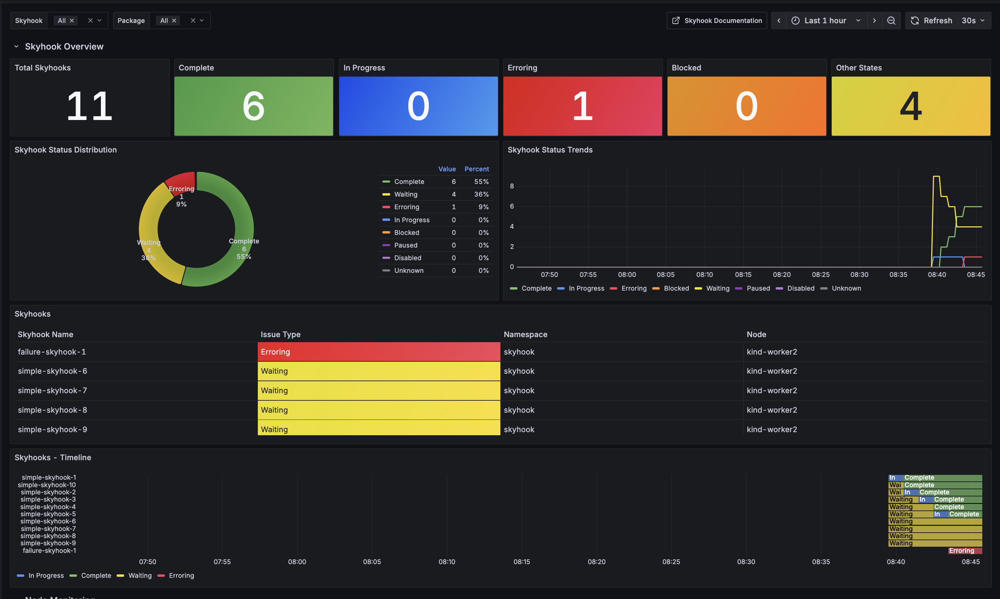
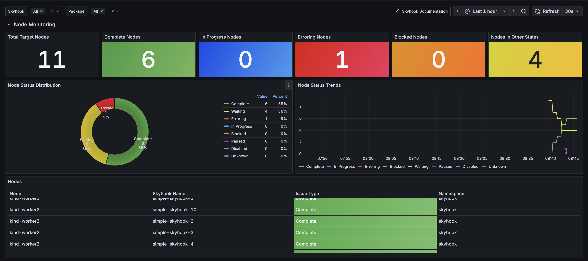
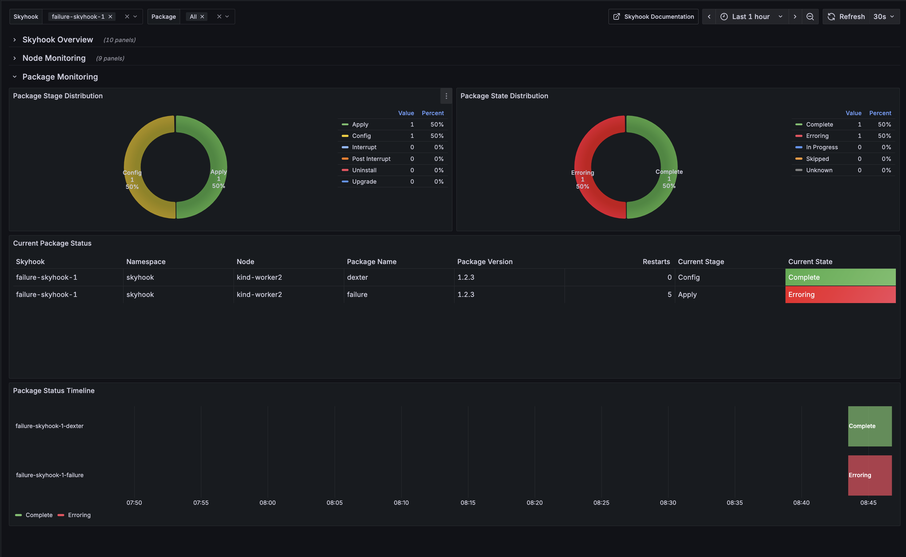

# Metrics
The current metrics supplied by the Operator are intended to be sufficient to determine the state of application of a Skyhook Custom Resource within a cluster. These metrics are defined at [internal/controller/metrics.go](../../operator/internal/controller/metrics.go).

## Skyhook Status Metrics
 * `skyhook_status` : Binary metric indicating the status of the Skyhook Custom Resource (1 if in that status, 0 otherwise). Tags:
    * `skyhook_name` : The name of the Skyhook Custom Resource
    * `status` : One of complete, disabled, paused

## Node Metrics
 * `skyhook_node_status_count` : Number of nodes in the cluster by status for the Skyhook Custom Resource. Tags:
    * `skyhook_name` : The name of the Skyhook Custom Resource
    * `status` : One of complete, in_progress, erroring, blocked, waiting
 * `skyhook_node_target_count` : Total number of nodes targeted by this Skyhook Custom Resource. Tags:
    * `skyhook_name` : The name of the Skyhook Custom Resource

## Package Metrics
 * `skyhook_package_state_count` : Number of nodes in the cluster by state for this package. Tags:
    * `skyhook_name` : The name of the SCR the package belongs to
    * `package_name` : The name of the package
    * `package_version`: The version of the package
    * `state` : One of complete, in_progress, skipped, erroring, unknown
 * `skyhook_package_stage_count` : Number of nodes in the cluster by stage for this package. Tags:
    * `skyhook_name` : The name of the SCR the package belongs to
    * `package_name` : The name of the package
    * `package_version`: The version of the package
    * `stage` : One of apply, config, interrupt, post_interrupt, uninstall, upgrade
 * `skyhook_package_restarts_count`: Number of restarts for this package on this node. Tags:
    * `skyhook_name` : The name of the SCR the package belongs to
    * `package_name` : The name of the package
    * `package_version`: The version of the package

Note: When a Skyhook is deleted all metrics for that Skyhook are no longer reported.

# Testing
See the script [metrics_test.py](../../k8s-tests/chainsaw/skyhook/metrics_test.py) that will let you test of exists or absence of metrics based on name and labels. The metrics endpoint can also be hit directly at:
```bash
curl http://localhost:8080/metrics
```
Or you can port forward to it in kubernetes if installed via the chart
```bash
kubectl port-forward svc/skyhook-operator-controller-manager-metrics-service -n skyhook  8080:8080
```

# Visualization
The makefile provides the `metrics` command which will install prometheus and grafana as a starting point for visualization.

## Dashboard
A comprehensive Grafana dashboard is provided at [dashboards/skyhook-dashboard.json](dashboards/skyhook-dashboard.json) that consolidates all Skyhook monitoring into a single dashboard with a unified view that includes:

### Skyhook Overview Section
- Total Skyhooks count
- Skyhook status distribution (Complete, In Progress, Erroring, Blocked, Other States)
- Skyhook status trends over time
- Detailed Skyhook status table



### Node Monitoring Section
- Total target nodes count
- Node status distribution (Complete, In Progress, Erroring, Blocked, Other States)
- Node status trends over time
- Detailed node status table



### Package Monitoring Section
- Package stage distribution across all packages
- Package state distribution across all packages
- Current package status table with detailed breakdown by package and version



The dashboard can be imported directly into Grafana or deployed using the generated ConfigMap from the `generate-dashboards.sh` script.

### Local Dashboard Setup
Use the following steps to setup and use the dashboard locally:
1. Move to the `operator` directory.
2. Run the follwing commands:

```bash
#!/bin/bash

# This assumes you already have a podman VM setup and
# that you don't have a kind cluster already setup
make create-kind-cluster

# Install the operator through the helm chart so that
# the /metrics endpoint is setup
helm install skyhook ../chart --namespace skyhook

# Setup prometheus and grafana on the cluster this will
# automatically install the dashboard into the local Grafana
# instance
make metrics

# WAIT UNTIL THE GRAFANA/PROMETHEUS PODS COME UP
sleep 30

# Port forward grafana so that you can access the
# dashboard
kubectl port-forward svc/grafana 3000:80 &

# Copy the output from this as it will be the
# admin password for the grafana
make grafana-password

```
3. Go to your browser and navigate to `http://localhost:3000`
4. Login using `admin` as the user and the output from the make command above as the password
5. You should now be able to navigate to the local instance of the dashboard through grafana's UI

## Prometheus Configuration
### Scrape directly
Use the file [prometheus_values.yaml](prometheus_values.yaml) as an example of configuring a scraper job for Skyhook. Note: This can be used directly with the prometheus community chart:
```bash
helm install prometheus prometheus-community/prometheus -f ../docs/metrics/prometheus_values.yaml
```

### Auto discovery
The current values file for the operator helm chart sets prometheus auto-discovery annotations for the http endpoint. Copied below:
```
metricsService:
  annotations:
    prometheus.io/scrape: "true"
    prometheus.io/port: "8080"
    prometheus.io/scheme: "http"
  ports:
  - name: metrics
    port: 8443
    targetPort: 8443
    protocol: TCP
  - name: metrics-http
    port: 8080
    targetPort: 8080
    protocol: TCP
  type: ClusterIP
```
To change to https set the scheme to `https` and the port to `8443` but you will need to set the prometheus auto-discovery to allow insecure tls. See the scrape directly example for known working values.


## Grafana configuration
After the chart is installed connect to the grafana instance and configure the prometheus datasource. An example that will work with the Makefile commands in operator is included here at [grafana_values.yaml](grafana_values.yaml).

### Dashboard Deployment
You can deploy the dashboard in several ways:

1. **Manual Import**: Import the `skyhook-dashboard.json` file directly through the Grafana UI
2. **ConfigMap Deployment**: Use the generated ConfigMap to automatically provision the dashboard:
   ```bash
   # Generate the ConfigMap
   ./generate-dashboards.sh

   # Apply to your cluster
   kubectl apply -f grafana-dashboards-configmap.yaml
   ```
3. **Makefile**: Running the `make metrics` target will automatically generate and apply the configmap so that every dashboard in the dashboards file will automatically be setup in grafana on sign-in.

