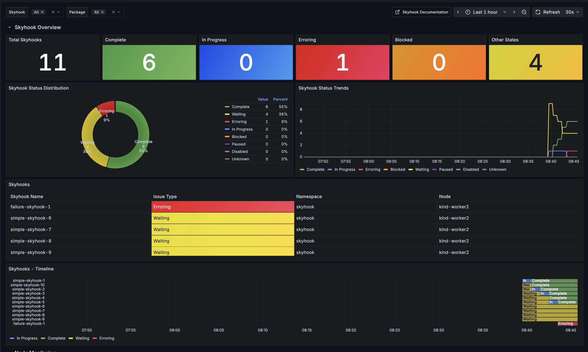
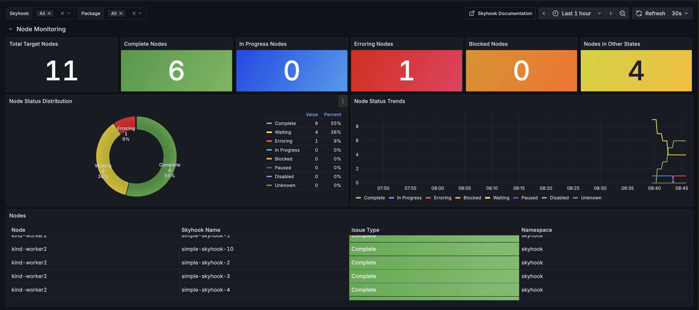
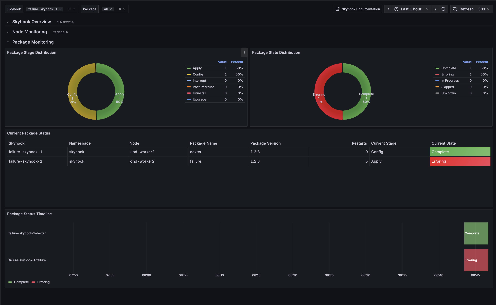

# Metrics

The current metrics supplied by the Operator are intended to be sufficient to determine the state of application of a NodeWright Custom Resource within a cluster. These metrics are defined at [internal/controller/metrics.go](../../operator/internal/controller/metrics.go).

## Deprecated: the `skyhook_*` metric names

> **The `skyhook_*` metrics are deprecated and will be removed in operator v0.20.0.**

As part of the Skyhook to NodeWright rename, every metric moved from the `skyhook_` prefix to `nodewright_`, and the shared series label moved from `skyhook_name` to `nodewright_name`. Metric names and label keys are the identifiers you write into dashboards and alerting rules, so both sets are published side by side for a deprecation window rather than swapped in place:

| | Metric name | CR-name label |
| --- | --- | --- |
| Current | `nodewright_status`, `nodewright_node_target_count`, … | `nodewright_name` |
| Deprecated | `skyhook_status`, `skyhook_node_target_count`, … | `skyhook_name` |

Both carry identical values and identical remaining labels, so a query migrates by swapping the prefix and the one label key. Nothing else changes.

The legacy set is removed in **v0.20.0**, the same release that removes the legacy `skyhook.nvidia.com` API group (see [the migration guide](../nodewright-migration.md)), so there is one deadline to plan against rather than two. Everything documented below uses the current names.

### Opting out early

Dual-publishing roughly doubles the operator's exported series count. If you have already migrated your dashboards and alerts, or you never consumed the legacy names, you can drop the deprecated half immediately:

```yaml
controllerManager:
  manager:
    env:
      publishLegacyMetrics: "false"   # PUBLISH_LEGACY_METRICS
```

The deprecated collectors are then unregistered at startup and `skyhook_*` disappears from `/metrics` entirely, rather than appearing with stale values. The default is `"true"`, so an upgrade that sets nothing keeps the compatibility window. This is a startup setting, not a runtime toggle.

## NodeWright Status Metrics

 * `nodewright_status` : Binary metric indicating the status of the NodeWright Custom Resource (1 if in that status, 0 otherwise). Tags:
    * `nodewright_name` : The name of the NodeWright Custom Resource
    * `status` : One of complete, blocked, waiting, disabled, paused, in_progress, erroring, unknown

## Node Metrics

 * `nodewright_node_status_count` : Number of nodes in the cluster by status for the NodeWright Custom Resource. Tags:
    * `nodewright_name` : The name of the NodeWright Custom Resource
    * `status` : One of complete, blocked, waiting, disabled, paused, in_progress, erroring, unknown
 * `nodewright_node_target_count` : Total number of nodes targeted by this NodeWright Custom Resource. Tags:
    * `nodewright_name` : The name of the NodeWright Custom Resource

## Package Metrics

 * `nodewright_package_state_count` : Number of nodes in the cluster by state for this package. Tags:
    * `nodewright_name` : The name of the CR the package belongs to
    * `package_name` : The name of the package
    * `package_version`: The version of the package
    * `state` : One of complete, in_progress, skipped, erroring, unknown
 * `nodewright_package_stage_count` : Number of nodes in the cluster by stage for this package. Tags:
    * `nodewright_name` : The name of the CR the package belongs to
    * `package_name` : The name of the package
    * `package_version`: The version of the package
    * `stage` : One of uninstall, uninstall-interrupt, upgrade, apply, interrupt, post-interrupt, config
 * `nodewright_package_restarts_count`: Number of restarts for this package on this node. Tags:
    * `nodewright_name` : The name of the CR the package belongs to
    * `package_name` : The name of the package
    * `package_version`: The version of the package

## Rollout Metrics (Deployment Policy)

These metrics track the rollout progress and health of compartments defined in a DeploymentPolicy. See [Deployment Policy documentation](../deployment_policy.md) for details on compartments and strategies.

 * `nodewright_rollout_matched_nodes` : Number of nodes matched by this compartment's selector. Tags:
    * `nodewright_name` : The name of the NodeWright Custom Resource
    * `policy_name` : The name of the DeploymentPolicy (or "legacy" if using interruptionBudget)
    * `compartment_name` : The name of the compartment (or `__default__` for unmatched nodes)
    * `strategy` : The rollout strategy type (fixed, linear, exponential, or unknown)
 * `nodewright_rollout_ceiling` : Maximum number of nodes that can be in progress at once in this compartment. Tags:
    * `nodewright_name` : The name of the NodeWright Custom Resource
    * `policy_name` : The name of the DeploymentPolicy
    * `compartment_name` : The name of the compartment
    * `strategy` : The rollout strategy type
 * `nodewright_rollout_in_progress` : Number of nodes currently in progress in this compartment. Tags:
    * `nodewright_name` : The name of the NodeWright Custom Resource
    * `policy_name` : The name of the DeploymentPolicy
    * `compartment_name` : The name of the compartment
    * `strategy` : The rollout strategy type
 * `nodewright_rollout_completed` : Number of nodes completed in this compartment. Tags:
    * `nodewright_name` : The name of the NodeWright Custom Resource
    * `policy_name` : The name of the DeploymentPolicy
    * `compartment_name` : The name of the compartment
    * `strategy` : The rollout strategy type
 * `nodewright_rollout_progress_percent` : Percentage of nodes completed in this compartment (0-100). Tags:
    * `nodewright_name` : The name of the NodeWright Custom Resource
    * `policy_name` : The name of the DeploymentPolicy
    * `compartment_name` : The name of the compartment
    * `strategy` : The rollout strategy type
 * `nodewright_rollout_current_batch` : Current batch number in the rollout strategy (0 if no batch processing). Tags:
    * `nodewright_name` : The name of the NodeWright Custom Resource
    * `policy_name` : The name of the DeploymentPolicy
    * `compartment_name` : The name of the compartment
    * `strategy` : The rollout strategy type
 * `nodewright_rollout_consecutive_failures` : Number of consecutive batch failures in this compartment. Tags:
    * `nodewright_name` : The name of the NodeWright Custom Resource
    * `policy_name` : The name of the DeploymentPolicy
    * `compartment_name` : The name of the compartment
    * `strategy` : The rollout strategy type
 * `nodewright_rollout_should_stop` : Binary metric indicating if rollout should be stopped due to failures (1 = stopped, 0 = continuing). Tags:
    * `nodewright_name` : The name of the NodeWright Custom Resource
    * `policy_name` : The name of the DeploymentPolicy
    * `compartment_name` : The name of the compartment
    * `strategy` : The rollout strategy type

Note: When a NodeWright is deleted all metrics for that NodeWright are no longer reported.

## Testing

See the script [metrics_test.py](../../k8s-tests/chainsaw/metrics_test.py) that will let you test for the existence or absence of metrics based on name and labels. The metrics endpoint requires a bearer token authorized for the `/metrics` non-resource URL. Create a scraper identity and bind it to the chart's metrics-reader role:
```bash
kubectl -n nodewright create serviceaccount metrics-reader
kubectl create clusterrolebinding metrics-reader-access \
  --clusterrole=skyhook-operator-metrics-reader \
  --serviceaccount=nodewright:metrics-reader
```

Then port-forward the HTTPS Service and scrape it with a short-lived token. TLS verification must be skipped because controller-runtime generates an in-memory self-signed certificate for each operator pod and does not publish a stable CA:

```bash
kubectl -n nodewright port-forward \
  svc/skyhook-operator-controller-manager-metrics-service 8443:8443 &
METRICS_TOKEN="$(kubectl -n nodewright create token metrics-reader)"
curl --insecure --header "Authorization: Bearer ${METRICS_TOKEN}" \
  https://127.0.0.1:8443/metrics
```

`metrics_test.py` can request the same token when the ServiceAccount and
namespace are provided by flags or environment variables:

```bash
SKYHOOK_NAMESPACE=nodewright \
METRICS_TEST_SERVICE_ACCOUNT=metrics-reader \
./k8s-tests/chainsaw/metrics_test.py \
  nodewright_node_target_count 1 -t nodewright_name=my-nodewright
```

For repeated checks, mint one token and reuse it instead of making a
TokenRequest for every invocation:

```bash
METRICS_TOKEN="$(kubectl -n nodewright create token metrics-reader)"
export METRICS_TOKEN
./k8s-tests/chainsaw/metrics_test.py \
  nodewright_node_target_count 1 -t nodewright_name=my-nodewright
```

When it has to mint a token, the helper writes only that token to stderr so a
Chainsaw script operation can capture `$stderr` as an output binding. Setting
`METRICS_TOKEN` on following operations reuses the token without another
process launch or TokenRequest.

## Visualization

The makefile provides the `metrics` command which will install prometheus and grafana as a starting point for visualization.

## Dashboard

A comprehensive Grafana dashboard is provided at [dashboards/skyhook-dashboard.json](dashboards/skyhook-dashboard.json) that consolidates all NodeWright monitoring into a single dashboard with a unified view that includes:

### NodeWright Overview Section

* Total NodeWrights count
* NodeWright status distribution (Complete, In Progress, Erroring, Blocked, Other States)
* NodeWright status trends over time
* Detailed NodeWright status table



### Node Monitoring Section

* Total target nodes count
* Node status distribution (Complete, In Progress, Erroring, Blocked, Other States)
* Node status trends over time
* Detailed node status table



### Package Monitoring Section

* Package stage distribution across all packages
* Package state distribution across all packages
* Current package status table with detailed breakdown by package and version



The dashboard can be imported directly into Grafana or deployed using the generated ConfigMap from the `generate-dashboards.sh` script.

### Local Dashboard Setup

Use the following steps to setup and use the dashboard locally:

1. Move to the `operator` directory.
2. Run the follwing commands:

```bash
#!/bin/bash

# This assumes you already have a podman VM setup and
# that you don't have a kind cluster already setup
make create-kind-cluster

# Install the operator through the helm chart so that
# the /metrics endpoint is setup
helm install skyhook ../chart --namespace nodewright \
  --set metrics.addServiceAccountBinding=true \
  --set metrics.serviceAccountName=prometheus \
  --set metrics.serviceAccountNamespace=default

# Setup prometheus and grafana on the cluster this will
# automatically install the dashboard into the local Grafana
# instance
make metrics

# WAIT UNTIL THE GRAFANA/PROMETHEUS PODS COME UP
sleep 30

# Port forward grafana so that you can access the
# dashboard
kubectl port-forward svc/grafana 3000:80 &

# Copy the output from this as it will be the
# admin password for the grafana
make grafana-password

```

1. Go to your browser and navigate to `http://localhost:3000`
2. Login using `admin` as the user and the output from the make command above as the password
3. You should now be able to navigate to the local instance of the dashboard through grafana's UI

## Prometheus Configuration

### Scrape directly

Use the file [prometheus_values.yaml](prometheus_values.yaml) as an example of configuring a scraper job for NodeWright. Note: This can be used directly with the prometheus community chart:
```bash
helm install prometheus prometheus-community/prometheus -f ../docs/metrics/prometheus_values.yaml
```

### Auto discovery

The operator chart does not advertise the metrics Service through
`prometheus.io/*` annotations by default:

```
metricsService:
  annotations: {}
  ports:
  - name: metrics
    port: 8443
    targetPort: 8443
    protocol: TCP
  type: ClusterIP
```

The prometheus-community chart's default `kubernetes-service-endpoints`
discovery job does not send a bearer token or disable certificate verification,
so annotations would continuously advertise a target that fails with a 401 or
x509 error. Use the explicit `role: endpoints` job in
[prometheus_values.yaml](prometheus_values.yaml), and bind the Prometheus
ServiceAccount to `skyhook-operator-metrics-reader`, as shown in the local
dashboard setup above. Endpoint discovery scrapes each operator pod separately;
this preserves the leader's reconcile metrics without intermittently routing a
single Service target to an idle standby replica.

## Grafana configuration

After the chart is installed connect to the grafana instance and configure the prometheus datasource. An example that will work with the Makefile commands in operator is included here at [grafana_values.yaml](grafana_values.yaml).

### Dashboard Deployment

You can deploy the dashboard in several ways:

1. **Manual Import**: Import the `skyhook-dashboard.json` file directly through the Grafana UI
2. **ConfigMap Deployment**: Use the generated ConfigMap to automatically provision the dashboard:
   ```bash
   # Generate the ConfigMap
   ./generate-dashboards.sh

   # Apply to your cluster
   kubectl apply -f grafana-dashboards-configmap.yaml
   ```
3. **Makefile**: Running the `make metrics` target will automatically generate and apply the configmap so that every dashboard in the dashboards file will automatically be setup in grafana on sign-in.
