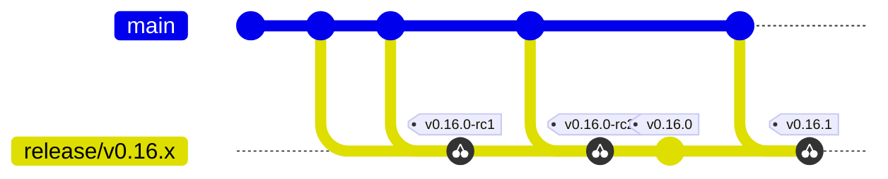

# Skyhook Release Process

Step-by-step process for releasing Skyhook components using **release branches**.

## Release Branch Strategy

At feature-freeze a release branch is cut from `main`. All release candidates and the final release for that minor version are tagged on that branch, and every later patch for the same minor line is cherry-picked back to the same branch and tagged from there. The release branch is the single source of truth for everything that ships under one minor version — once it exists, nothing for that minor goes anywhere else.

**Flow (one minor line):**



`X`, `Y`, `Z` are fixes that land on `main` first and get cherry-picked to `release/v0.16.x`. Each RC and the final release are tagged on that branch. Patches (`v0.16.1`, …) stay on the same release branch.

**Key principles:**

- **Branch first, then tag.** Always cut the release branch before the first RC. Tags only live on release branches, never on `main`.
- **Cherry-pick from `main`.** Any fix or feature destined for a release lands on `main` first, then is cherry-picked to the release branch. The release branch is never the place to *develop* — only to *stabilize and ship*.
  - Rare exception: a change that is genuinely release-branch-only (e.g. a `chart/Chart.yaml` version bump for that line) can be committed directly to the release branch via a feature branch and PR.
- **RCs are the validation gate.** Cut `-rc1`, `-rc2`, … on the release branch until you're happy. When an RC is approved, make a single `Chart.yaml` bump commit dropping the `-rcN` suffix and tag `vX.Y.0` on that commit — no other code changes between the last good RC and the final release.
- **Patches stay on the same branch.** `v0.16.1`, `v0.16.2`, … are all cut from `release/v0.16.x` — cherry-pick the fix from `main`, bump `chart/Chart.yaml`, tag.
- **Component naming:** Operator drives the release; agent often reuses the previous version; chart always gets tagged because `Chart.yaml` (and therefore `appVersion`) moves with every release.

### Major/Minor Release Workflow

```bash
# 1. Cut the release branch from main at feature-freeze.
git checkout main && git pull origin main
git checkout -b release/v0.16.x
git push origin release/v0.16.x

# 2. Cherry-pick anything that has merged to main since the cut but belongs in the release.
#    Repeat throughout the stabilization period.
git cherry-pick -x <sha-on-main>
git push origin release/v0.16.x

# 3. Prepare the chart for the RC. Edit chart/Chart.yaml:
#    version: v0.16.0-rc1
#    appVersion: v0.16.0-rc1
git commit -am "release: prepare v0.16.0-rc1"
git push origin release/v0.16.x

# 4. Tag the RC on the release branch.
git tag operator/v0.16.0-rc1
git tag chart/v0.16.0-rc1
# Tag agent only if it changed since the last released agent version.
git push origin operator/v0.16.0-rc1 chart/v0.16.0-rc1

# 5. Validate the RC. If issues are found, cherry-pick more fixes from main,
#    bump Chart.yaml to v0.16.0-rc2, and tag -rc2. Repeat until clean.

# 6. Cut the final release on the same commit as the last good RC.
#    Bump Chart.yaml to v0.16.0 (drop the -rcN suffix) and commit.
git commit -am "release: v0.16.0"
git push origin release/v0.16.x
git tag operator/v0.16.0
git tag chart/v0.16.0
git push origin operator/v0.16.0 chart/v0.16.0
```

**Automated:** Tests → Multi-platform build → Publish to `ghcr.io`

A `chart/v*` tag push also publishes the Helm chart as an OCI artifact to `oci://ghcr.io/nvidia/nodewright/charts/nodewright`. Consumers install with:

```bash
helm install nodewright oci://ghcr.io/nvidia/nodewright/charts/nodewright --version v0.16.0
```

### Distribution: ghcr.io only (for now)

Starting with `v0.16.0`, NodeWright is distributed **exclusively via GitHub Container Registry (`ghcr.io`)**:

| Artifact | Location |
| --- | --- |
| Operator image | `ghcr.io/nvidia/nodewright/operator` |
| Agent image | `ghcr.io/nvidia/skyhook/agent` *(migration to `ghcr.io/nvidia/nodewright/agent` pending)* |
| Helm chart (OCI) | `oci://ghcr.io/nvidia/nodewright/charts/nodewright` |

`v0.16.0` is the **first release using OCI on `ghcr.io` for the Helm chart** — previously the chart was published to the NGC Helm repository (`https://helm.ngc.nvidia.com/nvidia/skyhook`). The OCI distribution removes the `helm repo add` step entirely; Helm 3.8+ pulls from `oci://` URLs directly.

Distribution through `nvcr.io` / NGC is **paused** and is planned to return in a future release. Until then, the chart's image-pull defaults in `chart/values.yaml` point at `ghcr.io`. When NGC distribution resumes, the defaults and this section will be updated; users who pin to `ghcr.io` paths today won't be forced to migrate.

### Release Candidate Tag Format

Only two tag shapes are accepted by the release workflow per component:

- `<component>/v<MAJOR>.<MINOR>.<PATCH>` — final release
- `<component>/v<MAJOR>.<MINOR>.<PATCH>-rc<N>` — release candidate, published as a GitHub pre-release

Any other suffix (`-beta`, `-alpha`, `-rc.1`, `-rc1a`, etc.) is rejected by `.github/workflows/release.yml` so the tag format stays predictable.

Notes:

- Helm OCI accepts pre-release versions, so `chart/v0.16.0-rc1` pushes `nodewright-v0.16.0-rc1.tgz` to `oci://ghcr.io/nvidia/nodewright/charts`. Install with `--version v0.16.0-rc1`.
- `git cliff --latest` scopes release notes to commits since the previous tag of the same component, so each RC's notes only cover commits since the prior RC (or the prior stable, for `-rc1`).

### Patch Release Workflow

Patches stay on the existing release branch. Fix on `main` first, cherry-pick to the release branch, then tag.

```bash
# 1. Land the fix on main as a normal PR (so it ships in future minors too).
#    Note the commit SHA after it merges.

# 2. Cherry-pick to the active release branch.
git checkout release/v0.16.x
git pull origin release/v0.16.x
git cherry-pick -x <sha-on-main>

# 3. Bump chart/Chart.yaml to the new patch version.
#    version: v0.16.1
#    appVersion: v0.16.1
git commit -am "release: v0.16.1"
git push origin release/v0.16.x

# 4. Tag the components that changed and push *every* tag you created.
#    The push list MUST include the agent tag if you tagged the agent above —
#    otherwise the agent tag stays local and CI never sees it.
git tag operator/v0.16.1    # If operator changed
git tag agent/v6.4.1        # Only if agent changed (rare)
git tag chart/v0.16.1       # Chart always gets tagged
git push origin operator/v0.16.1 agent/v6.4.1 chart/v0.16.1  # drop any tag you didn't create
```

If the fix is urgent enough to need its own RC cycle, repeat the RC workflow above (e.g. `operator/v0.16.1-rc1`) before tagging `v0.16.1`.

### Agent-Only Changes

Agent-only fixes don't need a new minor; they ride on the active release branch as a chart patch.

```bash
# Land the agent fix on main, then cherry-pick to the active release branch.
git checkout release/v0.16.x
git cherry-pick -x <sha-on-main>

# Bump chart/Chart.yaml to reference the new agent version (e.g. update the
# agent tag/digest under controllerManager.manager.agent and bump the chart
# version to v0.16.1).
git commit -am "release: v0.16.1 (agent v6.4.1)"
git push origin release/v0.16.x

# Tag and push the components that changed.
git tag agent/v6.4.1
git tag chart/v0.16.1
git push origin agent/v6.4.1 chart/v0.16.1
```

### Release-Branch-Only Changes (rare)

If a change genuinely doesn't belong on `main` — for example, the `chart/Chart.yaml` version bump for `v0.16.1`, or a backport that doesn't apply cleanly and needs to be re-implemented for the older line — open it as a feature branch off the release branch and PR it back to the release branch. **Default to cherry-picking from `main` first; only diverge when there's a clear reason the change can't exist there.**

### Legacy: Individual Component Releases (Deprecated)

*The following workflows are deprecated in favor of the release branch strategy above.*

<details>
<summary>Click to expand legacy workflows</summary>

#### Operator Release (Legacy)

```bash
git checkout main && git pull origin main
git tag operator/v1.2.3
git push origin operator/v1.2.3
```

#### Agent Release (Legacy)

```bash
git checkout main && git pull origin main
git tag agent/v1.2.3
git push origin agent/v1.2.3
```

#### Chart Release (Legacy)

```bash
git checkout -b release/chart-v1.2.3
# Update Chart.yaml, create PR, merge
git checkout main && git pull origin main
git tag chart/v1.2.3
git push origin chart/v1.2.3
```

</details>

## Release Checklist

**Before cutting the release branch (minor / major):**

- [ ] All target features/fixes merged to `main`
- [ ] Tests passing on `main`
- [ ] Documentation updated on `main`

**Before each RC tag:**

- [ ] All intended cherry-picks from `main` have landed on the release branch
- [ ] `chart/Chart.yaml` `version` and `appVersion` match the RC tag (including the `-rcN` suffix)
- [ ] Tests passing on the release branch

**Before the final release tag:**

- [ ] The last RC validated successfully
- [ ] `chart/Chart.yaml` bumped to the non-RC version on the same commit
- [ ] No new commits between the validated RC and the release tag other than the `Chart.yaml` bump

### Pin multi-arch image digests in the chart

Starting with digest pinning, the chart references images using tag@digest (or digest-only where applicable). For each image, fetch the multi-arch manifest digest and update `chart/values.yaml` so our releases are reproducible across architectures.

Prerequisites:

- Docker buildx (`docker-buildx version`)

Fetch a multi-arch digest (example for bitnami/kubectl used by the webhook cleanup job):

```bash
docker-buildx imagetools inspect bitnami/kubectl:1.33.1
```

Example output (look for the top-level Digest):

```
Name:      docker.io/bitnami/kubectl:1.33.1
MediaType: application/vnd.docker.distribution.manifest.list.v2+json
Digest:    sha256:9081a6f83f4febf47369fc46b6f0f7683c7db243df5b43fc9defe51b0471a950

Manifests:
  Name:      docker.io/bitnami/kubectl:1.33.1@sha256:c8efec87588c7a2d84c760d54446b2e081e607a709f16f19283774d5612191b7
  MediaType: application/vnd.docker.distribution.manifest.v2+json
  Platform:  linux/amd64

  Name:      docker.io/bitnami/kubectl:1.33.1@sha256:2af8ed9feaeada845f4d60f1fe4db951df2e5334ea01bec4b5ef4f191ad20d65
  MediaType: application/vnd.docker.distribution.manifest.v2+json
  Platform:  linux/arm64
```

Update the digest in `chart/values.yaml` for kube-rbac-proxy, operator, and agent images:

Note:

- Always use the multi-arch manifest digest (top-level Digest from imagetools), not a single-arch child manifest digest.

**After tagging:**

- [ ] CI/CD pipeline completes
- [ ] Images and chart artifacts published successfully
- [ ] Test deployment with new version

### Verify release signatures and attestations

Release workflows publish keyless Sigstore signatures, CycloneDX SBOM attestations, and SLSA v1 provenance attestations for GHCR image and Helm chart release artifacts.

Prerequisites:

- Docker buildx (`docker buildx version`)
- cosign (`cosign version`)
- jq (`jq --version`)

The expected OIDC issuer is:

```bash
https://token.actions.githubusercontent.com
```

The expected certificate identity must match the specific component release workflow identity on that component's tag refs.

For operator images:

```bash
^https://github.com/NVIDIA/nodewright/\.github/workflows/operator-ci\.yaml@refs/tags/operator/.*$
```

For agent images:

```bash
^https://github.com/NVIDIA/nodewright/\.github/workflows/agent-ci\.yaml@refs/tags/agent/.*$
```

For Helm chart artifacts:

```bash
^https://github.com/NVIDIA/nodewright/\.github/workflows/release\.yml@refs/tags/chart/.*$
```

Resolve the artifact digest first, then verify by immutable digest:

#### Operator image

```bash
IMAGE=ghcr.io/nvidia/nodewright/operator
TAG=v0.15.0
DIGEST=$(docker buildx imagetools inspect "${IMAGE}:${TAG}" --format '{{json .Manifest}}' | jq -r '.digest')
SUBJECT="${IMAGE}@${DIGEST}"
IDENTITY='^https://github.com/NVIDIA/nodewright/\.github/workflows/operator-ci\.yaml@refs/tags/operator/.*$'
ISSUER='https://token.actions.githubusercontent.com'

cosign verify \
  --certificate-identity-regexp "${IDENTITY}" \
  --certificate-oidc-issuer "${ISSUER}" \
  "${SUBJECT}"
cosign verify-attestation \
  --certificate-identity-regexp "${IDENTITY}" \
  --certificate-oidc-issuer "${ISSUER}" \
  --type cyclonedx \
  "${SUBJECT}"
cosign verify-attestation \
  --certificate-identity-regexp "${IDENTITY}" \
  --certificate-oidc-issuer "${ISSUER}" \
  --type https://slsa.dev/provenance/v1 \
  "${SUBJECT}"
```

#### Agent image

```bash
IMAGE=ghcr.io/nvidia/nodewright/agent
TAG=v6.4.0
DIGEST=$(docker buildx imagetools inspect "${IMAGE}:${TAG}" --format '{{json .Manifest}}' | jq -r '.digest')
SUBJECT="${IMAGE}@${DIGEST}"
IDENTITY='^https://github.com/NVIDIA/nodewright/\.github/workflows/agent-ci\.yaml@refs/tags/agent/.*$'
ISSUER='https://token.actions.githubusercontent.com'

cosign verify \
  --certificate-identity-regexp "${IDENTITY}" \
  --certificate-oidc-issuer "${ISSUER}" \
  "${SUBJECT}"
cosign verify-attestation \
  --certificate-identity-regexp "${IDENTITY}" \
  --certificate-oidc-issuer "${ISSUER}" \
  --type cyclonedx \
  "${SUBJECT}"
cosign verify-attestation \
  --certificate-identity-regexp "${IDENTITY}" \
  --certificate-oidc-issuer "${ISSUER}" \
  --type https://slsa.dev/provenance/v1 \
  "${SUBJECT}"
```

#### Helm chart

```bash
CHART=ghcr.io/nvidia/nodewright/charts/skyhook-operator
TAG=v0.15.1
DIGEST=$(docker buildx imagetools inspect "${CHART}:${TAG}" --format '{{json .Manifest}}' | jq -r '.digest')
SUBJECT="${CHART}@${DIGEST}"
IDENTITY='^https://github.com/NVIDIA/nodewright/\.github/workflows/release\.yml@refs/tags/chart/.*$'
ISSUER='https://token.actions.githubusercontent.com'

cosign verify \
  --certificate-identity-regexp "${IDENTITY}" \
  --certificate-oidc-issuer "${ISSUER}" \
  "${SUBJECT}"
cosign verify-attestation \
  --certificate-identity-regexp "${IDENTITY}" \
  --certificate-oidc-issuer "${ISSUER}" \
  --type cyclonedx \
  "${SUBJECT}"
cosign verify-attestation \
  --certificate-identity-regexp "${IDENTITY}" \
  --certificate-oidc-issuer "${ISSUER}" \
  --type https://slsa.dev/provenance/v1 \
  "${SUBJECT}"
```

Use the same command pattern for each released artifact:

| Artifact | Immutable OCI subject |
|----------|-----------------------|
| GHCR operator image | `ghcr.io/nvidia/nodewright/operator@sha256:<digest>` |
| GHCR agent image | `ghcr.io/nvidia/nodewright/agent@sha256:<digest>` |
| GHCR Helm chart | `ghcr.io/nvidia/nodewright/charts/skyhook-operator@sha256:<digest>` |

## Common Commands

```bash
# Check current tags
git tag -l 'operator/v*' --sort=-v:refname | head -5
git tag -l 'agent/v*' --sort=-v:refname | head -5  
git tag -l 'chart/v*' --sort=-v:refname | head -5

# See what will be included in tag
git log --oneline $(git tag -l 'operator/v*' --sort=-v:refname | head -1)..HEAD

# Delete tag if needed (before CI runs)
git tag -d operator/v1.2.3
git push origin :refs/tags/operator/v1.2.3
```

## Third-Party Notices

Skyhook ships `THIRD_PARTY_NOTICES.md` files that list every third-party module shipped in its released artifacts, along with verbatim license text. Three files are maintained:

| File | Covers | Tool |
| --- | --- | --- |
| `operator/THIRD_PARTY_NOTICES.md` | Operator + CLI (Go) | `go-licenses` |
| `agent/THIRD_PARTY_NOTICES.md` | Agent (Python) | `pip-licenses` |
| `THIRD_PARTY_NOTICES.md` (repo root) | Combined rollup for `chart/` releases | Composed from the two component files |

### Regenerating locally

```bash
# All three at once:
make notices

# Or per-component:
make notices-operator   # operator + CLI Go deps
make notices-agent      # agent Python deps
make notices-rollup     # root rollup (run after the two above)
```

Prerequisites:

- `go-licenses` — installed via `make -C operator go-licenses` (writes `operator/bin/go-licenses`).
- Python 3 — required for the generator script and the agent pass's pip-licenses venv.

The agent pass caches a Python venv at `agent/.notices-venv`. First run installs `pip-licenses` and the agent's pinned deps (~30s). Subsequent runs reuse the venv (~2s).

### When to regenerate

Run `make notices` and commit the refreshed file(s) whenever you:

- Bump a Go dependency (changes to `operator/go.mod`, `operator/go.sum`, or `operator/vendor/`).
- Bump a Python dependency (changes to `agent/skyhook-agent/pyproject.toml` or `agent/vendor/`).

### CI behavior

- **Merge gate** (`.github/workflows/merge-gate.yaml`): when Go dependency files change in a PR, the `verify-licenses` job runs `make -C operator license-check` to confirm every dep's license is on the approved list. The job is required and a paired skip job satisfies the check when deps don't change.
- **Release upload** (`.github/workflows/release.yml`): every operator/agent/chart release regenerates the notices files in CI and attaches the appropriate one as a release asset:
  - `operator/v*` → `operator/THIRD_PARTY_NOTICES.md`
  - `agent/v*` → `agent/THIRD_PARTY_NOTICES.md`
  - `chart/v*` → root `THIRD_PARTY_NOTICES.md` (the combined rollup, since chart packages both images)

## Rollback

For problematic releases:

1. Tag new patch release with fixes
2. For critical issues: Update chart `appVersion` to previous stable version

See [versioning.md](versioning.md) for version strategy details. 
